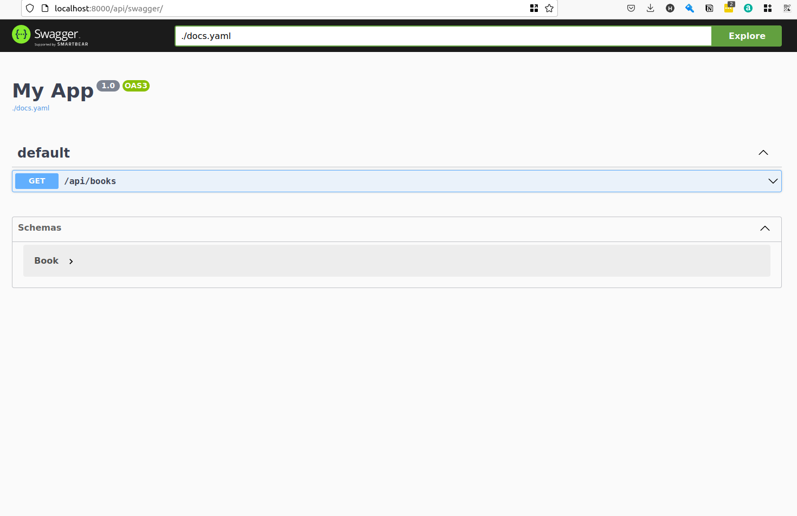

# Sttp Tapir + Akka Backend Example

## Add dependencies
```sbt
libraryDependencies ++= Seq(
  "com.softwaremill.sttp.tapir" %% "tapir-core" % "1.0.1",
  "com.softwaremill.sttp.tapir" %% "tapir-akka-http-server" % "1.0.1",
  "com.softwaremill.sttp.tapir" %% "tapir-json-circe" % "1.0.1"
)
```

## Create an Endpoint


## Enable Swagger UI
To generate OpenAPI documentation and expose it using the Swagger UI in a single step, first add the dependency:
```sbt
"com.softwaremill.sttp.tapir" %% "tapir-swagger-ui-bundle" % "1.0.1"
```

Then, you can interpret a list of endpoints using SwaggerInterpreter. The result will be a list of file-serving server endpoints, which use the yaml corresponding to the endpoints passed originally. These swagger endpoints, together with the endpoints for which the documentation is generated, will need in turn to be interpreted using your server interpreter. For example:
```scala
import sttp.tapir._
import sttp.tapir.swagger.bundle.SwaggerInterpreter
import sttp.tapir.server.akkahttp.AkkaHttpServerInterpreter

import scala.concurrent.Future
import scala.concurrent.ExecutionContext.Implicits.global

val myEndpoints: List[AnyEndpoint] = ???

// first interpret as swagger ui endpoints, backend by the appropriate yaml
val swaggerEndpoints = SwaggerInterpreter().fromEndpoints[Future](myEndpoints, "My App", "1.0")

// add to your akka routes
val swaggerRoute = AkkaHttpServerInterpreter().toRoute(swaggerEndpoints)
```

By default, the documentation will be available under the /docs path. The path, as well as other options can be changed when creating the SwaggerInterpreter and invoking fromEndpoints.
In this example we changed it to :
http://localhost:8000/api/swagger/

by the mean of the following code :
```scala
SwaggerInterpreter(
        swaggerUIOptions = SwaggerUIOptions(List("api", "swagger"), "swagger.yaml", Nil, useRelativePaths = true)
      )
```

And the UI will be accessible from http://localhost:8000/api/swagger/




resources :
- https://www.signifytechnology.com/blog/2019/03/describe-then-interpret-http-endpoints-using-tapir-by-adam-warski?source=google.com
- https://tapir.softwaremill.com/en/latest/server/akkahttp.html